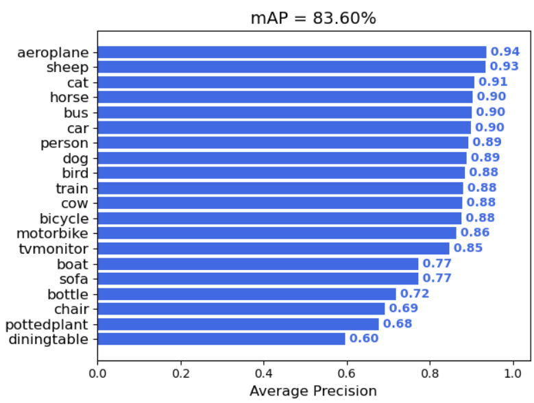
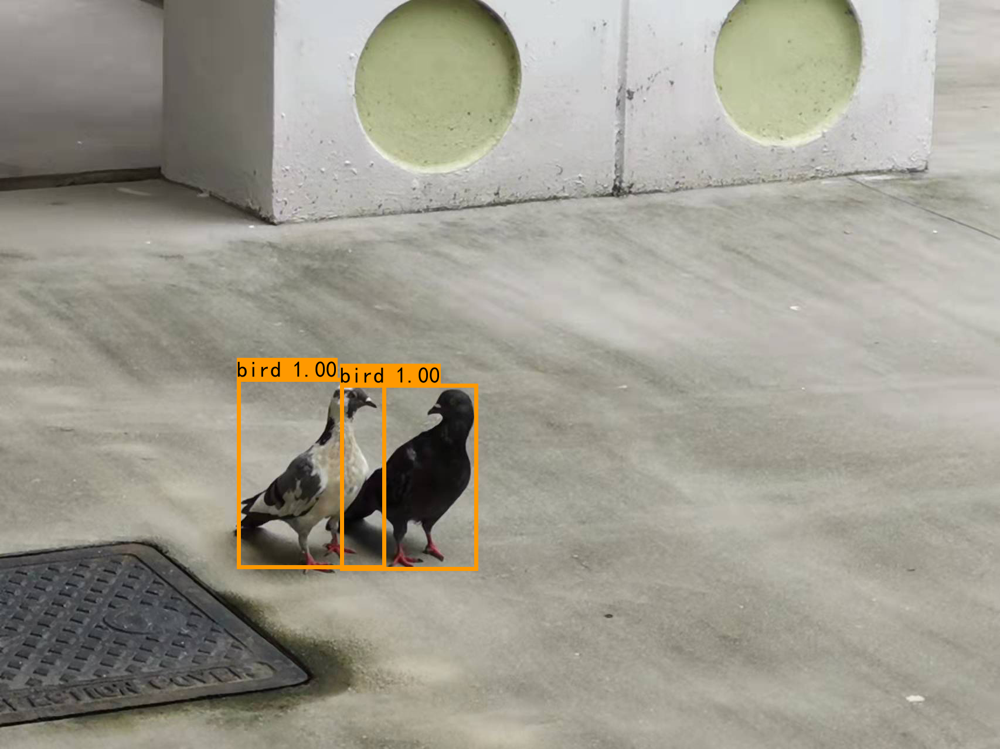
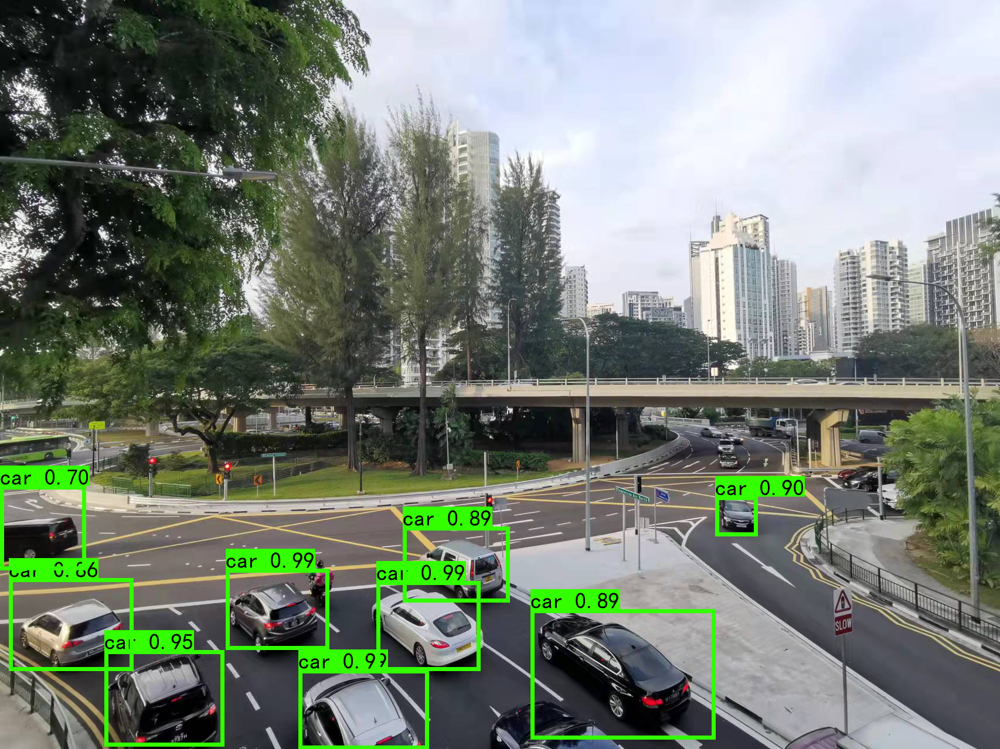

## YOLOV4-Tiny improved
---
**Improved method 1**   
Activation function (LeakyReLU to Mish) improved

**Improved method 2**   
Bayes modifier (include sigmoid and soft max) before NMS

## Final Performance

## How to run
### (a) Inference
1. Download the weight in link https://drive.google.com/file/d/1YPMjwnqV4NJu3Lm2sTNpC3XwrQPJjMzx/view?usp=sharing, put the weight file into `model_data`.  
2. run `get_prob.py` to generate bayes weight.  
3. Then you can run the `predict.py`.  
The program may ask you the path of image, you can input `img/street.jpg` as you want.  
### (b) Test on Pascal VOC 2007+2012
1. Download the dataset with link https://drive.google.com/file/d/1OIRpaoKEGxrTUJ5JyYiGHKI19y1j2UHm/view?usp=sharing
2. Unzip the file in `yolov4-tiny-improved`
3. Change model_path and classes_path in `yolo.py`  
**model_path is the path of weight file like `model_data/final.pth` classes_path should be the class nam.**  
5. run `get_map.py`
### (c) Train on Pascal VOC 2007+2012
1. Data process
run `voc_annotation.py` to generate index files.

2. Train
run `training.py`

3. Test
change the model_path in `yolo.py`  (the path you trained can be find in log directory)  
run `predict.py` or `get_map.py` 

## Result show

## Reference
https://github.com/bubbliiiing/yolov4-tiny-pytorch  
https://github.com/AlexeyAB/darknet
